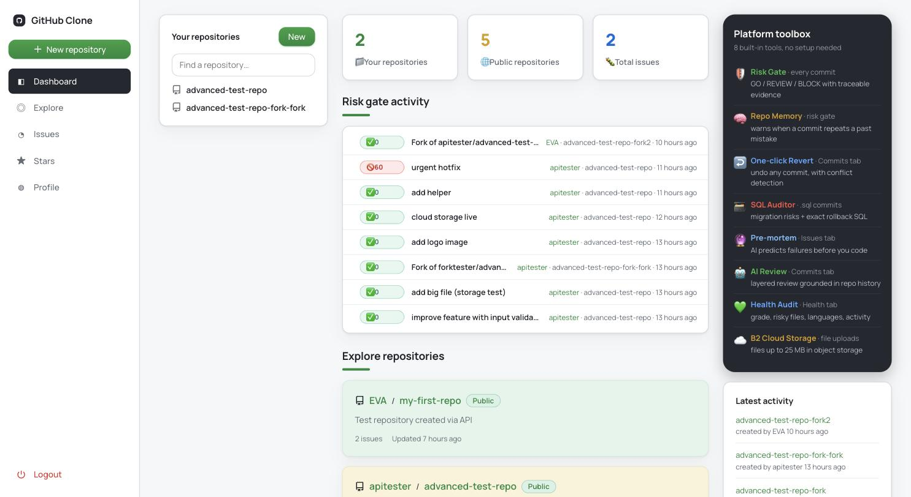
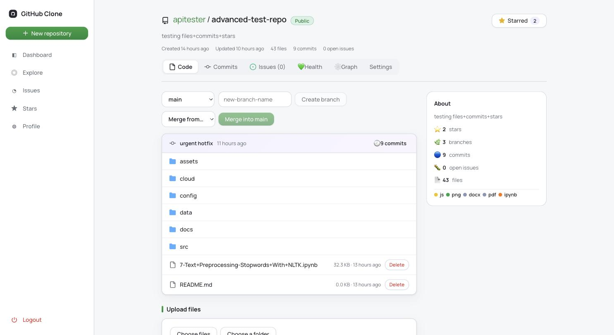
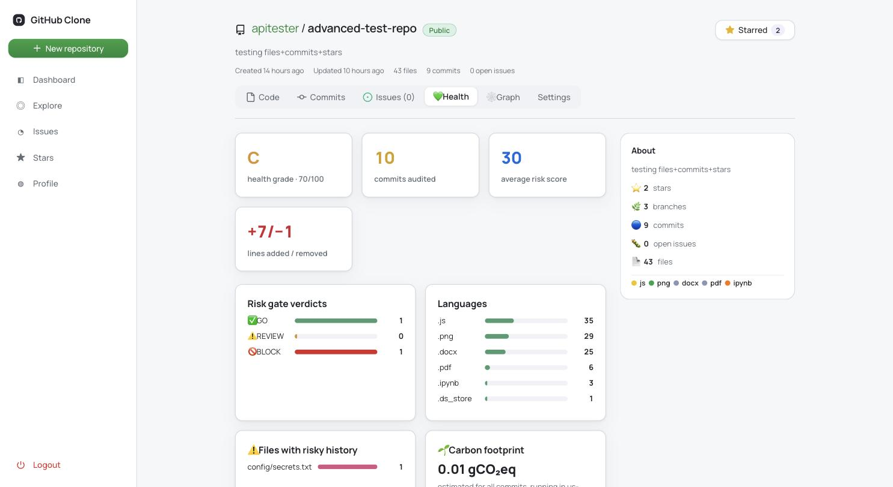
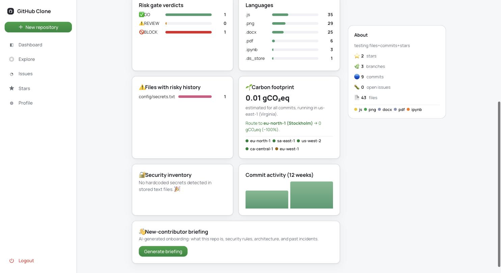

# GitHub Clone — an AI-augmented version-control platform

A full-stack (MERN) GitHub-style platform: repositories, branches, merges,
forks, issues, cloud file storage, and an **AI/analysis layer inspired by the
winning projects of the GitLab AI Hackathon 2026**. Every advanced feature runs
on **live data from your own commits and files** — nothing is mocked or
hardcoded.

- **Frontend:** React + Vite (`frontend-main/`)
- **Backend:** Node + Express + MongoDB (`backend-main/`)
- **Storage:** Backblaze B2 object storage (files up to 25 MB), MongoDB fallback
- **AI:** Anthropic Claude → OpenRouter free models → Gemini (first key that is set)

> Attribution for every borrowed algorithm/prompt is in
> [`ACKNOWLEDGMENTS.md`](./ACKNOWLEDGMENTS.md). Winner repos are cloned under
> `../winner-reference/` for reference.

---

## Screenshots

### Dashboard — left sidebar, risk-gate activity feed, platform toolbox


### Repository — segmented tabs (Code · Commits · Issues · Health · Graph · Settings) + About panel


### Health Audit — grade, risk-gate verdicts, languages, risky files (LORE-style)


### Carbon footprint · Security inventory · Onboarding briefing


---

## Running it locally

Requires **Node 22 LTS** (a newer default `node` may break `jsonwebtoken`),
MongoDB, and a `.env` in `backend-main/`.

```bash
# backend  (port 3002)
cd backend-main
/usr/local/bin/node index.js start

# frontend (port 5173)
cd frontend-main
npm run dev
```

`.env` keys: `MONGODB_URI`, `JWT_SECRET_KEY`, `OPENROUTER_API_KEY` (for AI
features), and `B2_KEY_ID` / `B2_APPLICATION_KEY` / `B2_BUCKET` / `B2_BUCKET_ID`
(for cloud storage). AI features degrade gracefully to a deterministic fallback
when no AI key is present.

---

## Feature list — what is real & dynamic, and where it came from

### Core version control (all live against MongoDB)
| Feature | What it does |
|---|---|
| Repositories | Create, public/private toggle, delete (cascades to files/commits/issues) |
| File upload + code viewer | Commit files; syntax-highlighted viewer for 20+ languages |
| Branches + merge | Create/switch branches; source-wins merge |
| Fork | Clone another user's repo under your account |
| Commit diffs | Per-file green/red unified diffs with +/− stats |
| Stars | Star repos; dedicated Stars page |
| Issues | Open/close/delete; cross-repo Issues page |
| Cloud storage | Backblaze B2 (25 MB), MongoDB inline fallback |
| Follow users | Follow/unfollow, public profiles, followers/following |
| Profile | Contribution heatmap, achievements, getting-started checklist |

### AI / analysis layer — ported from hackathon winners
Each of these computes on **your real commits/files/schema**, verified end-to-end.

| Feature | How it works (dynamic) | Ported from |
|---|---|---|
| **Risk Gate** | Scores every commit's real changes → GO/REVIEW/BLOCK with an evidence breakdown | Launch Control (policy-as-code) |
| **Repo Memory** | Queries your DB for past REVIEW/BLOCK commits touching the same files; escalates the verdict | LORE |
| **One-click Revert** | Applies stored reverse-diffs; refuses on conflict | Time-Traveler |
| **SQL Migration Auditor** | Parses your real `.sql` diffs; penalty model + exact rollback SQL | **Time-Traveler `migration_auditor.yml`** |
| **Auto-remediation** | A BLOCK commit auto-opens an issue with evidence + rollback plan | Launch Control |
| **AI Pre-mortem** | LLM reads your issue + repo history → failure predictions, questions, spec | **LORE SPECFORGE prompt** |
| **AI Code Review** | LLM reviews your real diff in layers (memory/security/intelligence/correctness) | **LORE GUARDKEEPER prompt** |
| **Health Audit** | Aggregates your commits → grade, verdict mix, languages, activity | LORE health auditor |
| **Onboarding Briefing** | LLM reads your real files/commits → new-contributor guide | **LORE ONBOARDING prompt** |
| **Security Inventory** | Scans your real file contents for hardcoded secrets | LORE health auditor |
| **Dependency Graph + ripple** | Parses your real imports; BFS to find impact of a change | **GraphDev** |
| **Circular-import detection** | DFS over the import graph | **LORE `validate.py::_detect_cycles` — ported line-by-line** |
| **Carbon Footprint** | SCI formula on your real commit sizes; greenest-region routing | **GreenPipe methodology** |
| **Data Smith** | LLM reads your real schema → realistic seed `INSERT` rows | **Time-Traveler `data_smith.yml`** |

### What could NOT be copied 1:1, and why
The winners are **Python + Docker + GitLab-cloud AI agents**. Their algorithms
were ported to Node/JS; their *infrastructure* cannot run inside a MERN app:
- GraphDev's tree-sitter + HDBSCAN + UMAP + Three.js 3D viewer (Python ML stack)
- Time-Traveler's Docker shadow-clones on a GCP VM
- The GitLab Duo Agent Platform runtime itself

**Launch Control** and **Department of Incidents** have **no public repo**
(private authors), so their features were rebuilt from the written descriptions,
not their source.

---

## Project layout

```
backend-main/
  services/
    riskEngine.js   # risk gate, memory, SQL auditor, security scan
    aiReviewer.js   # AI review, pre-mortem, onboarding (LORE prompts)
    depGraph.js     # dependency graph, BFS ripple, LORE DFS cycle detection
    carbon.js       # GreenPipe SCI carbon accounting
    dataSmith.js    # Time-Traveler seed-data generator
  controllers/ · models/ · routes/ · config/
frontend-main/
  src/components/
    dashboard/ · repo/ · user/ · auth/
docs/screenshots/   # feature screenshots
ACKNOWLEDGMENTS.md  # per-feature attribution to winner repos
```
